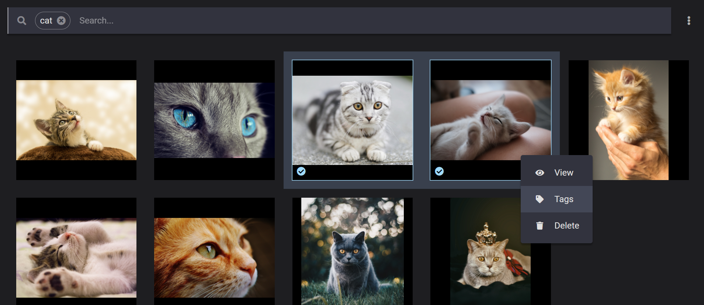
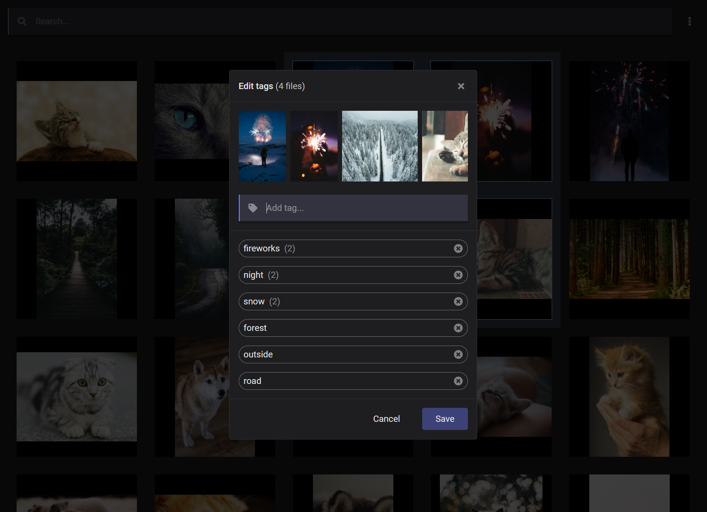

# Magius

A tag based image manager.

[→ Download Magius](https://github.com/simon-jaeger/Magius/releases)

## Features

- Open existing directories and browse the images within
- Tag your images to easily find them again
- Tags can be added and removed in bulk and even renamed later on
- Drag and drop files directly into and out of Magius

## Screenshots

